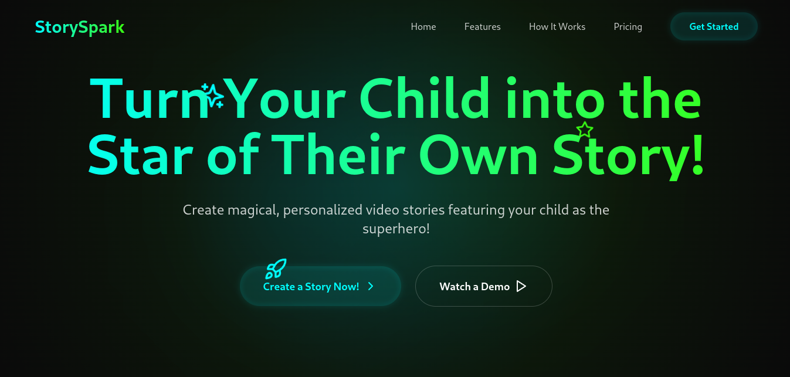

# StorySpark - Landing Page

**StorySpark** is a creative and engaging way to turn your child into a superhero. With simple steps and powerful personalization features, you can create custom video stories featuring your child. This is a landing page project for the StorySpark service, built using **React**, **Tailwind CSS**, and **TypeScript**, with animated and responsive design components, powered by **Vite**.

## Table of Contents
- [Project Overview](#project-overview)
- [Installation](#installation)
- [Usage](#usage)
- [Components](#components)
- [Screenshots](#screenshots)
- [Technologies Used](#technologies-used)
- [Contributing](#contributing)
- [License](#license)

## Project Overview

**StorySpark** is a web service that lets you create personalized video stories where your child becomes the protagonist! The app offers various themes, features, and customizable video quality, along with pricing plans that suit any family.

The landing page features:
- **Navbar** with smooth scrolling.
- **Hero Section** with action buttons.
- **Features Section** explaining the service.
- **How It Works Section** describing steps to use the platform.
- **Pricing Table** showcasing subscription options.
- **Testimonials** from satisfied parents.
- **Footer** with links to social media and app downloads.

## Installation

To get started with the project locally, follow these steps:

1. **Clone the repository**:
    ```bash
    git clone https://github.com/spshrishail/StorySpark.git
    ```
2. **Navigate to the project folder**:
    ```bash
    cd StorySpark
    ```
3. **Install the dependencies**:
    Ensure you have **Node.js** installed, then run:
    ```bash
    npm install
    ```
    
4. **Run the project**:
    After the dependencies are installed, run the following to start the development server:
    ```bash
    npm run dev
    ```

This will open up the project in your default browser at [http://localhost:5173/](http://localhost:5173/).

## Usage

Once the app is up and running:
- Browse through the landing page, check the Hero section, Features, How it Works, Testimonials, and Pricing table.
- You can interact with the scrollable sections, and navigate through the website using the Navbar that smoothly scrolls to each section.
- The mobile responsive design automatically adjusts the layout, displaying a mobile-friendly navigation.

## Components

### 1. **Navbar**
The navbar provides navigation and smooth scrolling for different sections: Home, Features, How It Works, Pricing, etc. The Navbar also supports mobile responsiveness with a mobile hamburger menu.

### 2. **Hero Section**
This is the first section of the landing page that displays a catchy headline with a call-to-action button leading to the sign-up page.

### 3. **Features**
Here, the key features of the StorySpark service are explained, including personalization and user-friendly design for children.

### 4. **How It Works**
The "How It Works" section breaks down the three easy steps for users to create a personalized video story.

### 5. **Testimonials**
The testimonials section displays customer reviews from parents, adding social proof and building trust in the service.

### 6. **Pricing**
This section displays the subscription pricing for the service: Free Trial, Premium, and Family Pack. Users can choose the right plan based on their needs.

### 7. **Footer**
The footer contains important links, social media buttons, and app download links.

## Screenshots


*The landing page UI for StorySpark showing smooth scroll navigation.*

## Technologies Used

- **React**: A JavaScript library for building user interfaces.
- **Vite**: A next-generation build tool that provides faster builds and hot module replacement (HMR).
- **Tailwind CSS**: Utility-first CSS framework used for styling.
- **SimpleBar**: A custom scrollbar solution used to enhance the page's visual feel.
- **Lucide-React**: A library of icons used throughout the landing page.
- **React Hooks** (`useState`, `useEffect`) for managing state and component lifecycle.
- **Responsive design** with Flexbox, Grid, and media queries for cross-device compatibility.

## Contributing

We welcome contributions to improve this landing page. If you would like to contribute, follow these steps:
1. Fork the repository.
2. Clone your forked repository to your local machine.
3. Create a new branch for your feature or bug fix:
    ```bash
    git checkout -b feature/your-feature-name
    ```
4. Make the necessary changes and commit them:
    ```bash
    git commit -m "Add your commit message here"
    ```
5. Push your changes to your forked repository:
    ```bash
    git push origin feature/your-feature-name
    ```
6. Open a Pull Request describing your changes.

## License

This project is licensed under the MIT License - see the [LICENSE](http://_vscodecontentref_/2) file for details.
